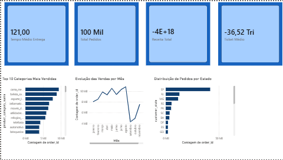

[](https://github.com/mateusfers/olist-analytics/actions/workflows/test.yml)
[](https://github.com/mateusfers/olist-analytics/actions/workflows/update_data.yml)

# Olist Analytics

Dashboard de performance de vendas do marketplace Olist.

## Contexto

Projeto de análise de dados para responder perguntas estratégicas sobre o negócio.

## Perguntas de Negócio

- Quais categorias de produto mais vendem?
- Qual o tempo médio de entrega e como isso impacta a nota do cliente?
- Qual a sazonalidade das vendas?
- Quais estados têm melhor performance?

## Estrutura do Projeto

```
olist-analytics/
├── data/
│   ├── raw/              # Dados brutos da Olist (CSVs)
│   └── processed_data.csv # Dados processados para Power BI
├── notebooks/            # Jupyter Notebooks
├── src/                  # Módulos Python
├── dashboard/            # Streamlit Dashboard
├── powerbi/              # Projeto Power BI
├── assets/               # Imagens e prints
├── .github/workflows/    # GitHub Actions
├── export_data.py        # Script para exportar dados
├── Dockerfile
├── docker-compose.yml
├── requirements.txt
└── README.md
```

## Stack Tecnológica

| Ferramenta | Propósito |
|------------|-----------|
| Python 3.10+ | Linguagem principal |
| Pandas, NumPy | Manipulação de dados |
| Matplotlib, Seaborn, Plotly | Visualização |
| Streamlit | Dashboard interativo |
| Power BI | Dashboard corporativo |
| Docker | Containerização |
| GitHub Actions | CI/CD |

## Como Rodar

### Localmente

```bash
# Clone
git clone https://github.com/mateusfers/olist-analytics.git
cd olist-analytics

# Ambiente virtual
python -m venv venv
venv\Scripts\activate

# Dependências
pip install -r requirements.txt

# Rodar dashboard
streamlit run dashboard/app.py
```

### Com Docker

```bash
docker build -t olist-dashboard .
docker run -p 8501:8501 olist-dashboard
```

## Insights

### 1. Tempo de Entrega e Nota do Cliente
Correlação de -0.35 entre tempo de entrega e nota do cliente.

### 2. Concentração no Sudeste
SP concentra 42% dos pedidos.

### 3. Sazonalidade
Agosto é pico (10.843 pedidos). Setembro é queda (4.305 pedidos).

## Prints

### Dashboard Streamlit


### Dashboard Power BI


## Entregáveis

- [x] Setup inicial
- [x] Dados baixados
- [x] Análise exploratória
- [x] Dashboard Streamlit
- [x] Dashboard Power BI
- [x] Docker
- [x] CI/CD

## Status

✅ Projeto concluído.

